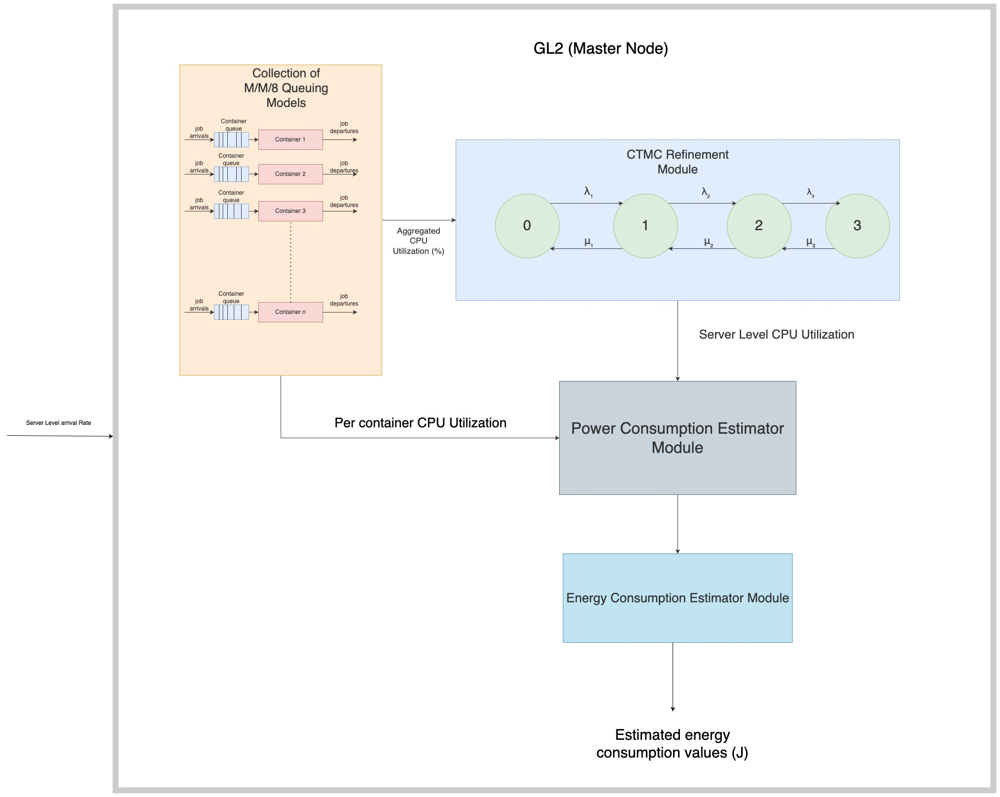

# A Queuing Network and Continuous Time Markov Chain based Hybrid Model that is capable of estimating the CPU Utilization, Power Consumption and Energy Consumption values for microservices-based applications deployed in a distributed setting

### Setup
- Navicate to the project directory and run the following command to setup virtual environment for python locally and install all the required dependencies required to run this model :
  
```bash
python3 setup_venv.py
```
- Activate the virtual environment by running :
 
```bash
source .venv/bin/activate
```

### How to run the model ? 
- Run the following bash script to run the model as well as all the data analysis scripts that will generate all the required comparison plots and error metrics
   
```bash
./run_model_and_analysis_scripts.sh <app_name> <user_scenario_name>
```
Where, valid combinations for app_name and user_scenario_name are : 
| App Name        | User Scenario Name  |
|----------------|--------------------|
| bookstore      | buy_books          |
| social_network | compose_posts      |
| social_network | follow_users       |


### Overview of Replication Package
This replication package is structured as follows:

```
    /
    .
    |--- ./model_cpu_utilization.py                                                                 Main simulation file for the Queuing Network and Continuous Time Markov Chain (CTMC) combined performance model
    |--- ./server_ctmc.py                                                                           The File with contains the main implementation of the CTMC
    |--- ./run_model_and_analysis_scripts.sh                                                        Simple shell script that runs the model and the data analysis scripts to get the prediction plots of the model
    |--- ./run_clean_up.sh                                                                          shell script that clears all the data estimated data based on the application name passed to it
    |--- ./setup_venv.py                                                                            This script when triggered creates a virtual python environment locally and install all the required dependencies required for the project
    |--- ./requirements.txt                                                                         Contains the list of dependencies to be installed
    |--- ./bookstore/buy_books/estimations/estimated_cpu_data                                       Contains the csv files and plots for the per container, per server CPU Utilization estimations done by the model for  bookstore buy_books scenario
    |--- ./bookstore/buy_books/estimations/estimated_power_consumption                              Contains the csv files and plots for the per container, per server Power  estimations done by the model for  bookstore buy_books scenario
    |--- ./bookstore/buy_books/estimations/plots/cpu_comparison_plots                               Contains the PNG image files for the comparisomn plots generated by the model for CPU Utilization estimations for  bookstore buy_books scenario
    |--- ./bookstore/buy_books/estimations/plots/power_consumption_comparison_plots                 Contains the PNG image files for the comparisomn plots generated by the model for power consumption  estimations for social-network buy_books scenario
    |--- ./social-network/compose_posts/estimations/estimated_cpu_data                              Contains the csv files and plots for the per container, per server CPU Utilization estimations done by the model for  social-network compose_posts scenario and error metric csv files
    |--- ./social-network/compose_posts/estimations/estimated_power_consumption                     Contains the csv files and plots for the per container, per server Power  estimations done by the model for  social-network compose_posts scenario and error metric csv files
    |--- ./social-network/compose_posts/estimations/plots/cpu_comparison_plots                      Contains the PNG image files for the comparisomn plots generated by the model for CPU Utilization estimations for  social-network compose_posts scenario 
    |--- ./social-network/compose_posts/estimations/plots/power_consumption_comparison_plots        Contains the PNG image files for the comparisomn plots generated by the model for power consumption  estimations for social-network compose_posts scenario
    |--- ./social-network/follow_users/estimations/estimated_cpu_data                              Contains the csv files and plots for the per container, per server CPU Utilization estimations done by the model for  social-network follow_users scenario and error metric csv files
    |--- ./social-network/follow_users/estimations/estimated_power_consumption                     Contains the csv files and plots for the per container, per server Power  estimations done by the model for  social-network follow_users scenario and error metric csv files
    |--- ./social-network/follow_users/estimations/plots/cpu_comparison_plots                      Contains the PNG image files for the comparisomn plots generated by the model for CPU Utilization estimations for  social-network follow_users scenario 
    |--- ./social-network/follow_users/estimations/plots/power_consumption_comparison_plots        Contains the PNG image files for the comparisomn plots generated by the model for power consumption  estimations for social-network follow_users scenario
    |--- ./social-network/compose_posts/model-config.json                                           Compost posts scenarin configuration file which is directly used in the performance model
    |--- ./social-network/follow_users/model-config.json                                            follow users scenarin configuration file which is directly used in the performance model  
    |--- ./buy_books/buy_books/model-config.json                                            follow users scenarin configuration file which is directly used in the performance model
```

### Overview of measured data is structured
```
    /
    .
    |--- ./bookstore/buy_books/buy_books_final/                                                Measured data against which the model is validated for social-network application with data for all iterations 1-10
    |--- ./bookstore/buy_books/buy_books/buy_books_final/1                                     Measured data for the 1st iteration
    |--- ./bookstore/buy_books/buy_books/buy_books_final/1/system_cpu_data                     Contains measured CPU utilization data per container, per server
    |--- ./bookstore/buy_books/buy_books/buy_books_final/1/power_consumption_data              Contains measured power consumption data per container, per server
    |--- ./bookstore/buy_books/buy_books/buy_books_final/transformed_data_kw_test/             Contains per server (GL2, GL5, GL6) measured data that is transformed from prometheus jsons to CSVs, and it contains KW test results csvs

    |--- ./social-network/compose_posts/compose_posts                                           Measured data against which the model is validated for social-network application with data for all iterations 1-10
    |--- ./social-network/compose_posts/compose_posts/1                                         Measured data for the 1st iteration
    |--- ./social-network/compose_posts/compose_posts/1/system_cpu_data                         Contains measured CPU utilization data per container, per server
    |--- ./social-network/compose_posts/compose_posts/1/power_consumption_data                  Contains measured power consumption data per container, per server
    |--- ./social-network/compose_posts/compose_posts/transformed_data_kw_test/                 Contains per server (GL2, GL5, GL6) measured data that is transformed from prometheus jsons to CSVs, and it contains KW test results csvs

    |--- ./social-network/follow_users/follow_users_final_run                                   Measured data against which the model is validated for social-network application with data for all iterations 1-10
    |--- ./social-network/follow_users/follow_users_final_run/1                                 Measured data for the 1st iteration
    |--- ./social-network/follow_users/follow_users_final_run/1/system_cpu_data                 Contains measured CPU utilization data per container, per server
    |--- ./social-network/follow_users/follow_users_final_run/1/power_consumption_data          Contains measured power consumption data per container, per server
    |--- ./social-network/follow_users/follow_users_final_run/transformed_data_kw_test/         Contains per server (GL2, GL5, GL6) measured data that is transformed from prometheus jsons to CSVs, and it contains KW test results csvs
```

### Overview of how data analysis scripts are structured

Note : This same struture is followed for the social network app as well

- ./social-network/compose_posts/scripts
- ./social-network/follow_users/scripts

```
    /
    .
    |--- ./bookstore/buy_books/scripts/transform_measured_utilization_data/data_transformer.py                                                             This is the script used to transform SAR CPU Util output and Powerstat Power consumption output to CSV
    |--- ./bookstore/buy_books/scripts/transform_measured_utilization_data/data_transformer_kw_test.py                                                     This is the script used to perform KW test on server level CPU util data across iterations

    |--- ./bookstore/buy_books/scripts/transform_measured_utilization_data/get_cpu_utilization_data_per_container.py                                       This is the script used to parse prometheus CPU Util data and segeregate it, and save it into csvs per container
    |--- ./bookstore/buy_books/scripts/transform_measured_utilization_data/get_power_consumption_data_per_container.py                                     This is the script used to parse prometheus Power Consumption data and segeregate it, and save it into csvs per container
    |--- ./bookstore/buy_books/scripts/transform_measured_utilization_data/perform_kw_test_per_container.py                                                This is the script used to per KW test on per container CPU Utilization data
    |--- ./bookstore/buy_books/scripts/transform_measured_utilization_data/perform_kw_test_per_container_power_consumption.py                              This is the script used to per KW test on per container power consumption data
    |--- ./bookstore/buy_books/scripts/comparison_scripts/cpu_utilization_comparison/cpu_utilization_comparision_per_container.py                          Script used to generate per container comparison plots (actual vs estimated)
    |--- ./bookstore/buy_books/scripts/comparison_scripts/cpu_utilization_comparison/server_cpu_utilization_comparison.py                                  Script used to generate per server level comparison plots (actual vs estimated) before ctmc refinement is applied
    |--- ./bookstore/buy_books/scripts/comparison_scripts/cpu_utilization_comparison/get_server_comparison_plots_after_ctmc_refinement.py                  Script used to generate per server level comparison plots (actual vs estimated) after ctmc refinement is applied
    |--- ./bookstore/buy_books/scripts/comparison_scripts/power_consumption_comparison/                                                                    Contains scripts to generate per container and per server comparison plots (actual vs estimated)
```

### Abstract Representation of a single server within the Performance Model

